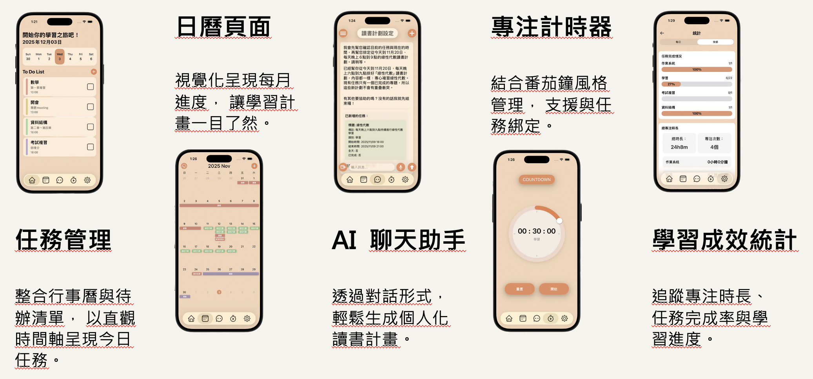

# studyAssistant

一款面向學生的 iOS 智慧學習管理應用，整合 AI 助手、任務管理、專注計時、統計分析與日曆規劃，協助使用者有效追蹤學習進度並養成良好的學習習慣。

### AI 聊天助手

內建 AI 聊天助手，透過自然語言對話即可直接管理學習任務。使用者只需用日常語句說明需求（例如「幫我安排這週每天兩小時英文」），AI 便會自動查詢現有任務、計算可用時段，並批次新增至行程，全程無需手動填寫表單。底層整合 OpenAI GPT，採用 Function Calling 機制讓 AI 能實際操作資料庫，並以串流方式即時顯示回應，支援語音輸入。

### 日曆助手自動更新

日曆助手具備每日自動更新功能，每天開啟 App 時會自動檢查是否有未完成的過期任務，並依照智慧重排規則重新安排行程。對於連續多天的相同課程，採用鏈式遞延邏輯，將整條學習計畫整體順移，避免計畫被打亂。所有變動均支援一鍵撤銷。

### 學習統計

自動彙整每個科目的任務數量、完成率與累計專注時間，提供每日與全部時間兩種視角切換，以長條圖視覺化呈現學習分布。AI 新增任務時會同步建立對應科目的統計紀錄，確保資料始終保持最新。

---

## Demo 展示

### 介面截圖



### Demo 影片

[YouTube](https://youtube.com/shorts/gLgCwytt8Ok?feature=share) | [本地下載（MP4）](專題成果-報告及海報展示與影片說明/專題demo影片.mp4)

---

## 專題發表成果

本專案為大學畢業專題作品，題目為「基於人工智慧之自適應學習規劃助理」，於畢業專題發表會進行成果展示。

### 發表影片

[YouTube](https://youtu.be/Sswmhg5Y1qE) | [本地下載（MP4）](<專題成果-報告及海報展示與影片說明/D7-林哲維-studyAssistant-您的智能學習夥伴 - Cho (1080p, h264).mp4>)

### 專題報告

[基於人工智慧之自適應學習規劃助理（PDF）](專題成果-報告及海報展示與影片說明/D7-林哲維-基於人工智慧之自適應學習規劃助理.pdf)

### 專題海報

[專題海報（PDF）](專題成果-報告及海報展示與影片說明/專題海報.pdf)

### 簡報

[發表簡報（PDF）](專題成果-報告及海報展示與影片說明/基於人工智慧之自適應學習規劃助理.pdf)

---

## 目錄

- [Demo 展示](#demo-展示)
- [專題發表成果](#專題發表成果)
- [功能總覽](#功能總覽)
- [技術棧](#技術棧)
- [專案架構](#專案架構)
- [AI Prompt 設計與優化](#ai-prompt-設計與優化)
- [目錄結構](#目錄結構)
- [環境需求](#環境需求)
- [安裝與設置](#安裝與設置)
- [Firebase Cloud Functions](#firebase-cloud-functions)
- [資料庫設計](#資料庫設計)

---

## 功能總覽

### 任務管理 (Todo Management)

- 建立、編輯、刪除學習任務
- 支援重複任務：每天、每週、每月
- 任務分類（科目）與顏色標記
- 子任務與備註支援
- 完成狀態獨立追蹤（每個任務實例）
- 通知提醒整合

### 專注計時器 (Focus Timer)

- 正向計時（從 0 開始）
- 倒數計時（設定目標時間）
- 圓環進度視覺化顯示
- 暫停、繼續與停止
- 背景計時支援（App 切換至背景不中斷）
- 計時記錄儲存，並與統計系統整合

### AI 聊天助手 (AI Chat Assistant)

- 串接 OpenAI GPT（支援 gpt-4o、gpt-4o-mini）
- 串流回應即時顯示
- Function Calling 機制：透過對話直接新增、刪除、修改任務
- 多聊天室管理
- Markdown 訊息渲染
- 語音輸入支援
- Token 使用量追蹤

### 統計分析 (Statistics)

- 按科目分類的學習統計
- 任務完成率與總數追蹤
- 專注時間累計（分鐘）
- 每日統計與全部時間統計切換
- 長條圖視覺化進度

### 日曆助手 (Calendar Assistant)

- 月曆與週曆視圖
- AI 自動分析任務與讀書偏好，生成每日學習計劃
- 批次任務操作（新增、刪除、更新）
- 撤銷 / 重做功能
- 每日自動更新機制
- 與通知系統整合

### 用戶系統 (User & Settings)

- Google OAuth 2.0 登入
- 個人資料管理（使用者名稱、座右銘、學習目標）
- 目標日期追蹤
- 讀書時段偏好設定（每週七天可用時段）
- 通知開關與提前提醒時間設定（0 / 5 / 10 / 15 / 30 / 60 分鐘）
- 深色模式支援

---

## 技術棧

### iOS 前端

| 項目           | 版本 / 說明                                        |
| -------------- | -------------------------------------------------- |
| 語言           | Swift 5.9+                                         |
| UI 框架        | SwiftUI（iOS 17.0+）                               |
| 非同步         | Swift Concurrency（async/await、Task、@MainActor） |
| 響應式         | Combine Framework                                  |
| 認證           | Firebase Authentication、Google Sign-In SDK        |
| 資料庫客戶端   | Firebase Firestore                                 |
| 雲端函式客戶端 | Firebase Functions                                 |
| 套件管理       | Swift Package Manager                              |

### 後端 (Firebase)

| 項目       | 版本 / 說明                                         |
| ---------- | --------------------------------------------------- |
| 資料庫     | Firebase Firestore（NoSQL）                         |
| 認證       | Firebase Authentication                             |
| 伺服器邏輯 | Firebase Cloud Functions（TypeScript / Node.js 20） |
| AI 代理    | 自建 GPT Proxy（Node.js）                           |
| 資料驗證   | Zod                                                 |

### AI

| 項目     | 說明                                                        |
| -------- | ----------------------------------------------------------- |
| 聊天助手 | gpt-4.1，串流開啟，tool_choice 動態策略                     |
| 日曆助手 | gpt-5.1，reasoning_effort: low，串流關閉，tool_choice: auto |
| 整合方式 | Function Calling（6 個工具）、Server-Sent Events 串流       |
| 部署     | 自建 Cloud Functions Proxy 轉發至 OpenAI API                |

---

## 專案架構

本專案採用 **MVVM（Model-View-ViewModel）** 架構，搭配 SwiftUI 的聲明式 UI 與 Combine 的響應式資料流。

```
View (SwiftUI)
    |
    | @StateObject / @ObservedObject / @EnvironmentObject
    v
ViewModel (ObservableObject, @Published)
    |
    | async/await
    v
Services (FirebaseService, Cloud Functions, OpenAI)
    |
    v
Model (Codable Structs)
```

- **Model**：定義資料結構（`TodoTask`、`UserProfile`、`LearningStatistic` 等），符合 `Codable` 協議以便序列化。
- **ViewModel**：處理業務邏輯、狀態管理、與外部服務的通訊。
- **View**：純粹負責 UI 顯示與使用者互動，不包含業務邏輯。
- **Services**：封裝 Firebase 操作與網路請求（`FirebaseService.swift`、`DataServiceProtocol.swift`）。

---

## AI Prompt 設計與優化

本專案有兩個獨立的 AI 模組：聊天助手（`ChatViewModel`）與日曆助手（`CalendarAssistantViewModel`），兩者採用不同的 Prompt 結構與模型配置，分別針對各自的使用場景優化。

---

### 一、聊天助手的 Prompt 設計（ChatViewModel）

#### 模型與請求配置

```
模型:       gpt-4.1
串流:       開啟（Server-Sent Events）
Temperature: 1.0
tool_choice: 動態決定（見下方策略）
```

#### System Prompt 結構：XML 標籤格式

聊天助手的 System Prompt 採用 XML 標籤格式組織，每個標籤定義 AI 行為的一個維度。以下是各標籤的作用：

| XML 標籤                   | 內容說明                                                                                                                                    |
| -------------------------- | ------------------------------------------------------------------------------------------------------------------------------------------- |
| `<role>`                   | 角色定義（高效率排程助理）、語氣（從 `StudySettings` 動態注入）、可用時段（由 `formatStudySettings()` 格式化後插入）                        |
| `<critical_rules>`         | 5 條硬性規則：任務只能落在可用時段、不得與現有任務重疊、computedDuration 時長計算邏輯、操作前必須先取得時間與任務、類別不可為空或「未分類」 |
| `<available_functions>`    | 列出 6 個可用函數及其使用時機，明確規定什麼情境必須呼叫哪個函數                                                                             |
| `<workflow>`               | 6 步驟工作流程：理解請求 → 詢問缺失資訊 → 讀取時間與任務 → 內部推理 → 呼叫函數 → 簡短回報                                                   |
| `<thinking_process>`       | 內部推理框架（僅 AI 內部使用，不得輸出給使用者）：計算 computedDuration、驗證可用性、驗證衝突、驗證類別                                     |
| `<scheduling_logic>`       | 時間安排邏輯：候選時間選擇規則（使用者指定優先，否則用「現在」）、Best-Fit 策略（優先填入最小可容納的空檔，避免時間碎片化）                 |
| `<ask_policy>`             | 詢問策略：優先直接安排，僅在「關鍵資訊不足且無法安全排程」時才一次性詢問                                                                    |
| `<large_batch>`            | 大批量任務（100+ 個）需一次性完成，禁止分批反覆確認                                                                                         |
| `<edge_cases>`             | 邊界情況處理：未設定可用時段、時段已滿、時段不夠長等情況的處理方式                                                                          |
| `<function_calling_rules>` | 函數呼叫規則：何時必須呼叫 `end_conversation`、無新資訊時禁止重複呼叫、回應文字中不得出現函數名稱                                           |
| `<output_style>`           | 輸出格式：先執行再回報、可附一行微型行程摘要（`YYYY-MM-DD HH:MM–HH:MM｜標題｜類別`）                                                        |
| `<final_reminder>`         | 最終提醒：整合所有核心規則的精簡版，作為模型最後一道約束                                                                                    |

**computedDuration（時長計算邏輯）**，是 `<critical_rules>` 的核心設計：

- 若使用者在 `StudySettings` 啟用了時長偏好 → 使用設定的分鐘數（如 60 分鐘）
- 若未啟用時長偏好：
  - 使用者明確說明時長 → 使用該時長
  - 未說明 → AI 依常理判斷

這個邏輯直接以 Swift 變數動態注入 Prompt，例如：`目前：已啟用，預設時長 60 分鐘`，讓 AI 在排程時能精確計算每個任務的結束時間。

#### 訊息陣列結構

每次請求的 `messages` 陣列由以下部分依序組成：

```
[System Message] + [對話歷史（user / assistant / function 交錯）]
```

訊息角色對應：

| 角色        | 來源          | 說明                                                                                              |
| ----------- | ------------- | ------------------------------------------------------------------------------------------------- |
| `system`    | System Prompt | 固定角色設定，每次請求都附帶                                                                      |
| `user`      | 使用者輸入    | `isMe == true` 的訊息                                                                             |
| `assistant` | AI 回應       | `isMe == false` 的訊息；操作類函數執行前也會額外插入一條 `assistant` 訊息記錄函數呼叫的 arguments |
| `function`  | 函數執行結果  | 系統執行函數後回傳的 JSON 或文字                                                                  |

操作類函數（`saveTask`、`deleteTask`、`updateTask`）執行前額外插入 `assistant` 訊息的原因：讓 AI 在後續輪次中能「記住」自己執行了哪些具體操作，防止在批量任務場景中重複呼叫相同函數。

#### Function Calling 工具定義

6 個工具以 `Tool` 結構（含 JSON Schema）定義，部分欄位的 description 本身就是 Prompt 的一部分：

| 函數               | 類型 | 關鍵 Prompt 設計                                                                                          |
| ------------------ | ---- | --------------------------------------------------------------------------------------------------------- |
| `getTask`          | 查詢 | 無參數，優先讀本地快取，為空才呼叫 Cloud Functions                                                        |
| `getTime`          | 查詢 | 無參數，回傳 `yyyy/MM/dd HH:mm:ss` 格式                                                                   |
| `saveTask`         | 操作 | `category` 欄位 description 明確禁止「未分類」；`color` 欄位附完整四色規則（紅/黃/綠/藍對應不同重要程度） |
| `deleteTask`       | 操作 | 接受 `taskIds` 陣列，支援批量刪除                                                                         |
| `updateTask`       | 操作 | 接受 `tasks` 陣列，每項必填 `taskId`，其餘欄位選填                                                        |
| `end_conversation` | 控制 | 無參數，觸發後 iOS 端發出 `conversationEndedSignal` 通知 UI                                               |

#### Tool Choice 動態策略

`tool_choice` 控制模型是否可以呼叫函數，本專案根據「第幾次請求」與「上次回應類型」動態切換：

| 請求次數 / 條件                | tool_choice | 原因                                                     |
| ------------------------------ | ----------- | -------------------------------------------------------- |
| 第 1 次                        | `none`      | 讓模型先以自然語言理解需求，避免過早呼叫函數造成誤解     |
| 第 2 次                        | `required`  | 強制取得真實資料（時間、現有任務），確保後續決策基於事實 |
| 上次為 `required`              | `auto`      | 資料已取得，給模型彈性決定下一步                         |
| 上次為 `auto` 且回應為文字     | `required`  | 模型說了話但未行動，推動它執行實際操作                   |
| 上次為 `auto` 且回應為函數呼叫 | `auto`      | 模型正在連續操作，保持彈性                               |

#### 多輪對話迴圈

單次使用者訊息可能觸發多次 OpenAI 請求。系統以 `while` 迴圈實現，直到收到文字回應或 `end_conversation` 為止：

```
while endConversationReached == false:
    1. 依上述策略決定 tool_choice
    2. 發送 OpenAIRequest（攜帶完整 messages 陣列）
    3a. AI 回應包含函數呼叫 → 本地執行函數，結果以 function role 加入 messages，繼續下一輪
    3b. AI 呼叫 end_conversation → 設定 endConversationReached = true，退出
    3c. AI 回應為純文字 → 逐 token 更新 UI（SSE），退出
```

最多同時支援並行多個函數呼叫（`functionCalls` 陣列），例如同時呼叫 `getTime` 和 `getTask`。

---

### 二、日曆助手的 Prompt 設計（CalendarAssistantViewModel）

#### 模型與請求配置

```
模型:           gpt-5.1
串流:           關閉（等待完整回應）
Temperature:    1.0
reasoning_effort: "low"
tool_choice:    "auto"（固定，讓模型自主決定）
最多對話輪次:   15 輪
```

日曆助手使用 `gpt-5.1` 搭配 `reasoning_effort: "low"`，因為日曆排程涉及多步驟推理（衝突偵測、時間計算），需要模型有一定的推理能力，但設為 `low` 以平衡速度與成本。關閉串流是因為日曆助手的結果需要一次性解析所有任務操作，不適合逐字顯示。

#### System Prompt 結構：純文字格式，由 `buildSystemPrompt()` 動態組裝

日曆助手的 Prompt 以純文字段落組成，在每次觸發更新時由 `buildSystemPrompt()` 動態生成：

**動態注入的內容：**

- **語氣**：從 `studySettings?.tone` 讀取（預設「冷靜且專業的專家」）
- **當前時間**：`getCurrentDate()` 的結果，直接嵌入 Prompt 內（不像聊天助手透過函數取得）
- **讀書時段**：`formatStudySettings()` 格式化的每週可用時段
- **現有任務 JSON**：`formatExistingTasks()` 將所有現有任務序列化為 JSON 後直接附在 Prompt 末尾

**固定規則（依是否有讀書設定分為兩個版本）：**

有讀書設定時（8 條規則）：

1. 無需操作時直接呼叫 `end_conversation`
2. 不進行不必要的更新（同一天內輕微時間差可接受）
3. 更新任務時按需更新標題與備註
4. 類別必須具體有意義，禁止「未分類」
5. 任務只能落在讀書設定的時段內，且持續時間為設定值
6. 所有操作必須在 `end_conversation` 前完成
7. 完全遵循使用者指示，不添加額外假設
8. 使用使用者的語言回應

無讀書設定時（6 條規則，移除時段限制的第 5 條）。

**與聊天助手的關鍵差異：**

| 面向         | 聊天助手                | 日曆助手                                   |
| ------------ | ----------------------- | ------------------------------------------ |
| 取得當前時間 | 透過 `getTime` 函數呼叫 | 直接注入 Prompt                            |
| 取得現有任務 | 透過 `getTask` 函數呼叫 | 直接注入 Prompt（`formatExistingTasks()`） |
| tool_choice  | 動態切換                | 固定為 `auto`                              |
| 串流         | 開啟                    | 關閉                                       |
| 模型         | gpt-4.1                 | gpt-5.1 + reasoning                        |
| Prompt 格式  | XML 標籤                | 純文字段落                                 |

日曆助手在 Prompt 中預先注入時間與任務資料，省去了查詢類函數的往返，因為日曆助手每次執行都是全量分析，不需要動態決定是否要查詢。

---

### 三、串流回應與安全機制

- **Server-Sent Events（SSE）**：聊天助手的 API 回應以逐 token 串流方式推送，iOS 端逐行解析 `data:` 開頭的 SSE 事件，即時呼叫 `onToken` 回調更新 UI，降低感知延遲。
- **Cloud Functions Proxy**：所有 OpenAI API 請求透過自建的 `chatProxy` Cloud Function 轉發，OpenAI API Key 永不出現在客戶端程式碼或網路封包的可見部分。
- **錯誤重試**：網路錯誤時自動重試，使用指數退避策略，搭配任務取消機制（`Task.isCancelled` 檢查）確保使用者隨時可以中止請求。

---

## 目錄結構

```
studyAssistant/
├── studyAssistant/                  # iOS App 主目錄
│   ├── studyAssistantApp.swift      # App 入口點
│   ├── Authentication.swift         # 認證狀態管理
│   ├── Login.swift                  # 登入視圖
│   ├── Config.swift                 # 環境配置
│   ├── Models/                      # 資料模型
│   │   ├── TodoTask.swift           # 任務與重複實例模型
│   │   ├── TimerRecord.swift        # 計時記錄模型
│   │   ├── Static.swift             # 學習統計模型
│   │   ├── UserProfile.swift        # 使用者個人資料
│   │   ├── AppSettings.swift        # 應用設定（含通知）
│   │   └── StudySettings.swift      # 讀書偏好設定
│   ├── ViewModels/                  # 視圖模型（業務邏輯）
│   │   ├── TodoViewModel.swift      # 任務管理邏輯
│   │   ├── TimerManager.swift       # 計時器邏輯
│   │   ├── ChatViewModel.swift      # 聊天助手與 GPT 整合
│   │   ├── StaticViewModel.swift    # 統計資料管理
│   │   ├── CalendarAssistantViewModel.swift  # 日曆助手邏輯
│   │   ├── UserSettingsViewModel.swift       # 用戶設定管理
│   │   └── ProfileViewModel.swift   # 個人資料管理
│   ├── Views/                       # UI 視圖
│   │   ├── ContentView.swift        # 主導覽框架
│   │   ├── TodoView.swift           # 任務列表（含週曆）
│   │   ├── TodoAddView.swift        # 新增任務
│   │   ├── TodoEditView.swift       # 編輯任務
│   │   ├── TodoDetailView.swift     # 任務詳情
│   │   ├── TimerView.swift          # 計時器視圖
│   │   ├── Chatview.swift           # 聊天助手視圖
│   │   ├── ChatSettingView.swift    # 聊天設定
│   │   ├── StatisticsView.swift     # 統計分析視圖
│   │   ├── CalenderView.swift       # 日曆視圖
│   │   ├── CalendarAssistantPopupView.swift  # 日曆助手彈窗
│   │   ├── SettingsView.swift       # 應用設定視圖
│   │   └── ProfileSettingView.swift # 個人資料設定
│   ├── Services/                    # 服務層
│   │   ├── FirebaseService.swift    # Firebase 操作封裝
│   │   └── DataServiceProtocol.swift
│   ├── Managers/
│   │   └── NotificationManager.swift  # 通知排程管理
│   ├── Constants/
│   │   └── NotificationConstants.swift
│   └── Extensions/                  # Swift 擴展
│       ├── Color+Extension.swift
│       ├── Date+Extension.swift
│       └── View+Extension.swift
│
├── firebase_cloud_function/         # Firebase 後端
│   ├── functions/                   # Cloud Functions（TypeScript）
│   │   └── src/                     # 原始碼（24+ 個函式）
│   └── gpt_proxy/                   # OpenAI API 代理伺服器
│
└── studyAssistant.xcodeproj/        # Xcode 專案檔
```

---

## 環境需求

### 開發機器

| 項目         | 需求                             |
| ------------ | -------------------------------- |
| 作業系統     | macOS 14.0 (Sonoma) 或更新       |
| Xcode        | 15.0 或更新                      |
| Swift        | 5.9 或更新                       |
| Node.js      | 20.x LTS（Cloud Functions 開發） |
| Firebase CLI | 最新版                           |

### 目標裝置

- iOS 17.0 或更新版本

---

## 安裝與設置

### 1. 複製專案

```bash
git clone <repository-url>
cd studyAssistant
```

### 2. 設定 Firebase

1. 前往 [Firebase Console](https://console.firebase.google.com) 建立專案。
2. 啟用以下服務：
   - Authentication（開啟 Google 登入）
   - Firestore Database
   - Cloud Functions
3. 下載 `GoogleService-Info.plist`，放置於 `studyAssistant/` 目錄下（取代現有的佔位檔案）。

### 3. 設定 OpenAI API 代理

1. 進入代理目錄：

   ```bash
   cd firebase_cloud_function/gpt_proxy
   npm install
   ```

2. 在 `gpt_proxy/` 下建立 `.env` 檔案，填入您的 OpenAI API Key：

   ```
   OPENAI_API_KEY=sk-...
   ```

3. 部署或本機啟動代理伺服器，並將 URL 更新至 `Config.swift` 中對應的端點設定。

### 4. 部署 Cloud Functions

```bash
cd firebase_cloud_function/functions
npm install
npm run build
firebase deploy --only functions
```

### 5. 開啟 Xcode 專案

以 Xcode 開啟 `studyAssistant.xcodeproj`，選擇目標裝置或模擬器後建置並執行。

> Swift Package Manager 依賴（Firebase SDK、GoogleSignIn）會在首次建置時自動解析下載。

---

## Firebase Cloud Functions

後端採用 Firebase Cloud Functions（TypeScript），共部署 24+ 個函式，涵蓋以下功能：

| 類別     | 函式                                                             |
| -------- | ---------------------------------------------------------------- |
| 用戶資料 | `getUserProfile`、`updateUserProfile`                            |
| 應用設定 | `getAppSettings`、`updateAppSettings`                            |
| 讀書設定 | `getStudySettings`、`updateStudySettings`                        |
| 任務管理 | `createTask`、`fetchTasks`、`updateTask`、`deleteTask`           |
| 任務實例 | `createTaskInstance`、`updateTaskInstance`、`deleteTaskInstance` |
| 統計資料 | `getStatistics`、`saveStatistic`、`deleteStatistic`              |

所有 Firestore 操作皆透過 Cloud Functions 執行，iOS 端使用 `FirebaseFunctions` SDK 呼叫，不直接對資料庫進行寫入，確保資料驗證與安全規則的一致性。

---

## 資料庫設計

使用 Firebase Firestore（NoSQL）作為主要資料庫，所有資料依 `userId` 隔離。

```
Root
├── users/{userId}                    # 使用者基本資訊
├── settings/{userId}                 # 應用設定（含通知）
├── studySettings/{userId}            # 讀書偏好與時段設定
├── tasks/{userId}/
│   └── userTasks/{taskId}            # 任務文件
│       └── instances/{instanceId}    # 重複任務實例
├── userStatistics/{userId}/
│   └── statistics/{statisticId}      # 學習統計（按科目）
└── chatHistories/{userId}/
    └── messages/{messageId}          # 聊天訊息記錄
```

計時記錄（`TimerRecord`）使用 `UserDefaults` 儲存於本機，不同步至 Firestore。

---

## 授權

本專案為畢業專題作品，僅供學術用途。
