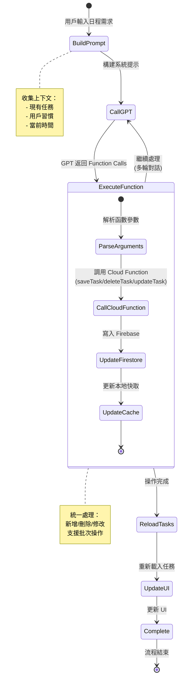

# 日曆助手 Firebase 操作狀態轉換圖

## Firebase 操作詳細狀態

## 狀態說明

### 流程概述

整個日曆助手的運作從用戶輸入日程需求開始。系統首先會構建系統提示（BuildPrompt），收集現有任務列表、用戶的讀書習慣設定、用戶自定義的更新規則以及當前時間等上下文資訊。

接著透過 chatProxy Cloud Function 調用 GPT API（CallGPT），將這些資訊傳送給 GPT 進行分析。GPT 會根據用戶需求決定要執行哪些操作，並返回對應的 Function Calls。

當收到 GPT 的回應後，系統進入執行函數階段（ExecuteFunction）。這個階段統一處理新增、刪除、修改三種任務操作。過程包含解析 GPT 傳回的參數、調用對應資料庫的 Cloud Function、將資料寫入 Firebase Firestore，最後更新本地快取以追蹤變更。

由於某些複雜需求可能需要多次操作才能完成，GPT 可能會進行多輪對話。系統會循環執行「調用 GPT → 執行函數」的流程，最多進行 15 輪，直到 GPT 調用 `end_conversation` 函數為止。

所有操作完成後，系統會重新從 Firebase 載入任務（ReloadTasks），確保獲得最新的資料狀態。接著更新使用者界面（UpdateUI），顯示任務變更卡片，讓用戶清楚看到哪些任務被新增、刪除或修改。最後進入完成狀態（Complete），此時用戶可以查看完整的變更記錄，並在需要時執行一鍵撤回操作。

---

## 與聊天室流程的差異

| 特性             | 聊天室   | 日曆助手                           |
| ---------------- | -------- | ---------------------------------- |
| AI 模式          | 即時串流 | 批次處理                           |
| 操作類型         | 單一操作 | 批次操作                           |
| 對話輪次         | 無限制   | 最多 15 輪                         |
| Function Calling | 可選     | 必須 (`tool_choice: "required"`) |
| 實例生成         | 無       | 重複任務需要                       |
| 撤回功能         | 無       | 支援一鍵撤回                       |
| UI 更新          | 即時顯示 | 完成後顯示卡片                     |

---

## 關鍵優化

1. **批次操作**: 使用 Firestore batch 減少網路請求
2. **本地快取**: 優先使用 `todoViewModel.tasks` 避免重複查詢
3. **智能重試**: 429 錯誤自動重試，其他錯誤直接失敗
4. **實例管理**: 更新時保留已完成實例，只重新生成未完成的
5. **持久化**: 任務變更記錄保存到 UserDefaults，可跨會話查看
