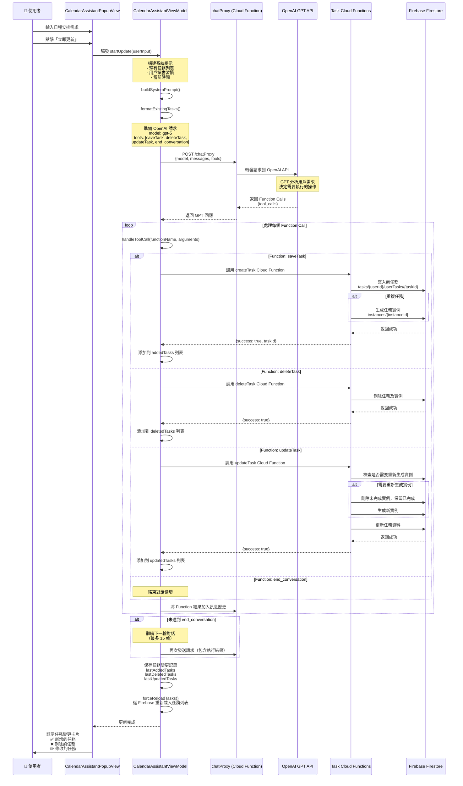

# 日曆助手 GPT 處理流程

## 簡介

日曆助手是一個智能日程安排功能，透過 GPT 的 Function Calling 機制來自動化管理用戶的任務。整個流程涉及客戶端（SwiftUI）、Cloud Functions（chatProxy）、OpenAI GPT API，以及 Firebase Firestore。

---

## 完整流程圖



---

## 流程詳細說明

### 1. 用戶輸入階段
- **輸入位置**: `CalendarAssistantPopupView` 的 TextEditor
- **輸入內容**: 用戶希望如何調整日曆的自然語言描述
- **觸發**: 點擊「立即更新」按鈕

### 2. 構建系統提示 (buildSystemPrompt)

ViewModel 會自動收集以下資訊構建完整的系統提示：

```swift
// 系統提示包含：
1. 語氣設定（來自 studySettings.tone）
2. 用戶讀書習慣（讀書時段、時長）
3. 當前時間
4. 重要規則（不做不必要更新等）
5. 現有任務列表（JSON 格式）
```

### 3. 發送請求到 chatProxy

**請求結構**:
```json
{
  "model": "gpt-5",
  "messages": [
    {"role": "system", "content": "系統提示..."},
    {"role": "user", "content": "用戶輸入..."}
  ],
  "temperature": 1.0,
  "stream": false,
  "tools": [
    {
      "type": "function",
      "function": {
        "name": "saveTask",
        "description": "Save one or multiple tasks...",
        "parameters": {...}
      }
    },
    // deleteTask, updateTask, end_conversation
  ],
  "tool_choice": "required"
}
```

**URL**: `https://asia-east1-studyassistant-f7172.cloudfunctions.net/chatProxy`

**Timeout**: 600 秒（10 分鐘）

### 4. GPT 分析與 Function Calling

GPT 會根據用戶輸入和現有任務列表，決定需要執行的操作：

- **saveTask**: 新增一個或多個任務
  - 必須包含所有必要欄位（title, note, category, startDate, endDate, isAllDay, isCompleted, color）

- **deleteTask**: 刪除指定 taskId 的任務
  - 參數: `{ taskIds: [taskId1, taskId2, ...] }`

- **updateTask**: 更新現有任務
  - 參數: `{ tasks: [{ taskId, title?, note?, ... }] }`

- **end_conversation**: 完成所有操作，結束對話

### 5. 執行 Function Calls

ViewModel 收到 GPT 的 `tool_calls` 後，會逐一執行：

#### 5.1 executeSaveTask
```swift
1. 解析 JSON 參數
2. 轉換日期格式（ISO 8601 → Date）
3. 解析顏色、類別等屬性
4. 呼叫 Cloud Functions: createTask
5. 檢查並創建統計類別
6. 添加到 addedTasks 列表
7. 重新載入任務列表
```

#### 5.2 executeDeleteTask
```swift
1. 解析任務 ID 列表
2. 呼叫 Cloud Functions: deleteTask
3. 從本地快取獲取任務資訊（顯示用）
4. 添加到 deletedTasks 列表
5. 重新載入任務列表
```

#### 5.3 executeUpdateTask
```swift
1. 解析更新參數
2. 從本地或 Firebase 獲取原任務資料
3. 合併新舊資料
4. 呼叫 Cloud Functions: updateTask
5. 添加到 updatedTasks 列表
6. 重新載入任務列表
```

### 6. Cloud Functions 處理

#### createTask (index.ts:189)
```typescript
1. 驗證用戶身份
2. 準備任務資料（添加 userId, timestamps）
3. 處理重複任務的結束日期
4. 使用 Firestore batch 寫入
5. 如果是重複任務：
   - 計算實例日期（calculateNextOccurrences）
   - 生成實例文檔（最多 365 個）
6. 提交 batch
7. 返回 {success: true, taskId}
```

#### updateTask (index.ts:893)
```typescript
1. 驗證用戶身份
2. 檢查任務是否存在
3. 判斷是否需要重新生成實例
   - 重複類型改變
   - 開始/結束時間改變
   - 重複結束時間改變
4. 如果需要重新生成：
   - 保留已完成實例
   - 刪除未完成實例
   - 生成新實例
5. 更新任務本身
6. 提交 batch
7. 返回 {success: true}
```

#### deleteTask (index.ts:385)
```typescript
1. 驗證用戶身份
2. 使用 batch 操作
3. 刪除所有任務實例
4. 刪除主任務文檔
5. 提交 batch
6. 返回 {success: true}
```

### 7. Firebase 資料結構

```
Firestore:
└── tasks/
    └── {userId}/
        └── userTasks/
            └── {taskId}/
                ├── title
                ├── note
                ├── category
                ├── startDate (Timestamp)
                ├── endDate (Timestamp)
                ├── isAllDay
                ├── isCompleted
                ├── color
                ├── repeatType {type, ...}
                ├── repeatEndDate (Timestamp)
                ├── createdAt (Timestamp)
                ├── updatedAt (Timestamp)
                └── instances/
                    └── {instanceId}/
                        ├── date (Timestamp)
                        ├── isCompleted
                        ├── parentTaskId
                        └── createdAt (Timestamp)
```

### 8. 多輪對話機制

如果 GPT 需要多次調用 Function（例如先新增再刪除），會進行多輪對話：

```
輪次 1: 用戶輸入 → GPT 調用 saveTask → 執行成功
輪次 2: 執行結果 → GPT 調用 deleteTask → 執行成功
輪次 3: 執行結果 → GPT 調用 end_conversation → 結束
```

**限制**: 最多 15 輪對話

### 9. UI 顯示更新結果

**任務卡片顯示**:
- ✅ **新增的任務** (綠色背景): 顯示 `lastAddedTasks`
- ❌ **刪除的任務** (紅色背景): 顯示 `lastDeletedTasks`
- ✏️ **修改的任務** (藍色背景): 顯示原始與更新後的對比

**持久化**: 所有任務變更記錄會保存到 UserDefaults，即使關閉視窗也能再次查看

### 10. 撤回功能

用戶可以撤回上一次的更新操作：

```swift
1. 檢查是否已經撤銷過（hasUndone）
2. 針對新增的任務 → 調用 deleteTask 刪除
3. 針對刪除的任務 → 調用 createTask 重新創建
4. 針對修改的任務 → 調用 updateTask 恢復原始狀態
5. 重新載入任務列表
6. 清除任務卡片記錄
7. 標記已撤銷（防止重複撤銷）
```

---

## 重點技術細節

### 日期格式轉換
- **Swift → Cloud Functions**: ISO 8601 字串 (`convertTimestampsToStrings`)
- **Cloud Functions → Firestore**: Timestamp 物件
- **GPT → Swift**: ISO 8601 字串需要解析為 Date (`parseDate`)

### 重複任務實例生成
```typescript
calculateNextOccurrences(task, limit = 365):
  - daily: 每天生成一個實例
  - weekly: 每週同一天生成
  - monthly: 每月同一日期生成（處理月末日期）
  - 限制：最多 365 個實例，或到 repeatEndDate
```

### 錯誤處理與重試
- **網路超時**: 600 秒（10 分鐘）
- **429 錯誤**: 指數退避重試（最多 5 次）
- **取消機制**: 支持用戶中途取消更新

### 性能優化
- 使用 Firestore batch 操作減少網路請求
- 優先使用本地快取（避免重複查詢 Firebase）
- 任務卡片只顯示第一個，可展開查看全部

---

## 安全性考量

1. **身份驗證**: 所有 Cloud Functions 都檢查 `request.auth`
2. **資料驗證**: 必要欄位檢查（taskId, title 等）
3. **權限控制**: 用戶只能操作自己的任務（userId 隔離）
4. **錯誤日誌**: 使用 Logger 記錄所有操作與錯誤

---

## 相關文件

- [CalendarAssistantViewModel.swift](../studyAssistant/ViewModels/CalendarAssistantViewModel.swift)
- [CalendarAssistantPopupView.swift](../studyAssistant/Views/CalendarAssistantPopupView.swift)
- [Cloud Functions index.ts](../firebase_cloud_function/database_functions/src/index.ts)

---

## 總結

日曆助手透過以下步驟完成智能日程安排：

1. **收集上下文**: 用戶輸入 + 現有任務 + 習慣設定
2. **GPT 分析**: 使用 Function Calling 決定操作
3. **執行操作**: 透過 Cloud Functions 操作 Firestore
4. **更新 UI**: 顯示任務變更卡片
5. **支持撤回**: 保留操作記錄，可一鍵撤銷

整個流程設計充分利用了 GPT 的理解能力和 Firebase 的即時性，提供了流暢的用戶體驗。
