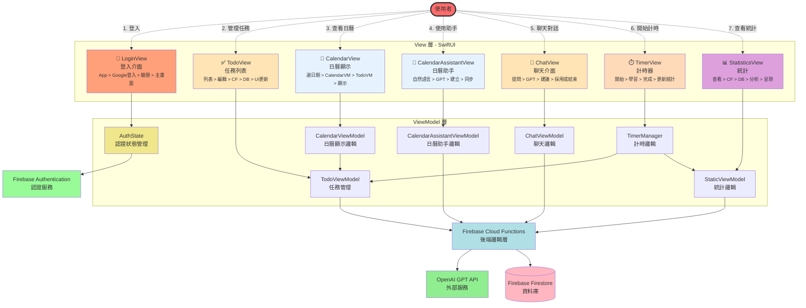
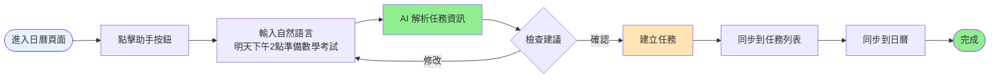
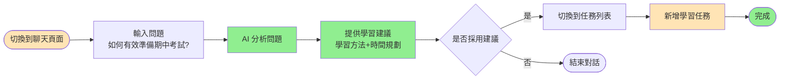
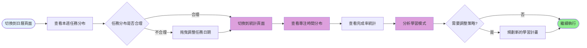

# 系統組件關係圖

## 🛠️ 技術堆疊 (Technology Stack)

<div align="center">

### 前端開發 (Frontend)


### 後端開發 (Backend)


### 資料庫 (Database)


### 認證服務 (Authentication)


### AI 服務 (AI Services)


### 開發工具 (Development Tools)


### 第三方套件 (Third-party Libraries)


</div>

---

## 綜合架構關係



---

## 組件關係說明

### 使用者互動流程（虛線箭頭）

使用者透過不同的功能頁面與系統互動：

1. **登入流程**: 使用者開啟 App 後首先進入 LoginView 進行 Google 登入
2. **管理任務**: 在 TodoView 中新增、編輯、刪除、完成任務
3. **查看日曆**: 在 CalendarView 中查看任務的日曆視圖
4. **使用助手**: 在 CalendarAssistantPopupView 中與 AI 助手對話，快速建立任務
5. **聊天對話**: 在 ChatView 中與 AI 進行學習相關的對話
6. **開始計時**: 在 TimerView 中使用番茄鐘計時功能
7. **查看統計**: 在 StatisticsView 中查看學習統計和專注時間分析

### View → ViewModel

每個 View 都綁定對應的 ViewModel，透過 `@EnvironmentObject` 或 `@StateObject` 注入。View 負責顯示，ViewModel 負責邏輯與狀態管理。

### 認證流程

- **LoginView** 透過 **AuthState** 處理 Google 登入
- **AuthState** 與 **Firebase Authentication** 通訊，管理用戶登入狀態
- 登入成功後，所有 ViewModel 可存取用戶資訊

### ViewModel → Cloud Functions

- **TodoViewModel**、**ChatViewModel**、**CalendarAssistantViewModel** 和 **StaticViewModel** 透過 Cloud Functions 處理所有後端邏輯
- **CalendarViewModel** 透過 **TodoViewModel** 取得任務資料並顯示在日曆上

### ViewModel → ViewModel

- **TimerManager** 需要與 **TodoViewModel** 和 **StaticViewModel** 協作，當計時完成時更新任務專注時間和統計資料
- **CalendarViewModel** 依賴 **TodoViewModel** 取得任務資料進行日曆顯示

### Cloud Functions → Database

Cloud Functions 封裝所有資料庫操作，包括任務 CRUD、聊天記錄管理、統計資料更新等，統一處理 Firestore 讀寫邏輯和資料驗證。

### Cloud Functions → External

Cloud Functions 作為中間層，統一處理所有對 OpenAI GPT API 的請求，提供 API 金鑰保護和請求限流。

---

## 主要資料流

### 1️⃣ 登入流程

```
使用者 → 點擊 Google 登入按鈕 → LoginView → AuthState → Firebase Authentication
→ 驗證成功 → 取得用戶資料 → 進入主畫面
```

### 2️⃣ 任務操作流

**使用者操作**: 新增/編輯/刪除/完成任務

```
使用者 → 操作任務 → TodoView → TodoViewModel → Cloud Functions
→ Firestore 寫入/更新 → 同步回 TodoViewModel → 更新 UI
```

### 3️⃣ 查看日曆流

**使用者操作**: 查看特定日期的任務

```
使用者 → 選擇日期 → CalendarView → CalendarViewModel → TodoViewModel
→ 取得任務資料 → 過濾該日期任務 → 顯示在日曆上
```

### 4️⃣ 日曆助手流

**使用者操作**: 與 AI 助手對話，快速建立任務

```
使用者 → 輸入自然語言 → CalendarAssistantView → CalendarAssistantViewModel
→ Cloud Functions → GPT (Function Calling) → 解析任務資訊
→ Cloud Functions → Firestore 寫入 → 同步回 TodoViewModel → 更新任務列表
```

### 5️⃣ 聊天對話流

**使用者操作**: 與 AI 進行學習相關對話

```
使用者 → 發送訊息 → ChatView → ChatViewModel → Cloud Functions
→ GPT API 處理 → 回傳回應 → 儲存至 Firestore → 顯示對話
```

### 6️⃣ 計時器流

**使用者操作**: 開始專注計時

```
使用者 → 開始計時 → TimerView → TimerManager → 計時完成
→ 更新 TodoViewModel (任務專注時間)
→ 更新 StaticViewModel → Cloud Functions → Firestore (統計資料)
```

### 7️⃣ 統計資料流

**使用者操作**: 查看學習統計

```
使用者 → 查看統計 → StatisticsView → StaticViewModel → Cloud Functions
→ Firestore 讀取 → 回傳統計資料 → 視覺化呈現
```

---

## 關鍵依賴關係

| ViewModel                  | 依賴 ViewModel                 | 依賴服務                |
| -------------------------- | ------------------------------ | ----------------------- |
| AuthState                  | -                              | Firebase Authentication |
| TodoViewModel              | -                              | Cloud Functions         |
| ChatViewModel              | -                              | Cloud Functions         |
| CalendarViewModel          | TodoViewModel                  | -                       |
| CalendarAssistantViewModel | TodoViewModel                  | Cloud Functions         |
| TimerManager               | TodoViewModel, StaticViewModel | -                       |
| StaticViewModel            | -                              | Cloud Functions         |

---

## 組件職責

**使用者**

- 系統的主要互動者，透過不同功能頁面完成學習管理任務
- 主要操作包括：
  - 登入系統
  - 管理任務（新增、編輯、刪除、完成）
  - 查看任務日曆視圖
  - 與 AI 助手對話快速建立任務
  - 與 AI 聊天獲得學習建議
  - 使用番茄鐘計時專注學習
  - 查看學習統計和分析

**View 層**

- 負責 UI 顯示、用戶互動、事件觸發
- 不包含業務邏輯
- 包含登入介面、任務列表、聊天介面、日曆顯示、日曆助手、計時器、統計等視圖

**ViewModel 層**

- 負責業務邏輯、狀態管理、協調後端服務
- **AuthState**: 管理用戶認證狀態，處理登入/登出
- 其他 ViewModel 是 View 和資料層之間的橋樑
- **不直接存取 Database**，所有資料操作都透過 Cloud Functions

**Firebase Authentication**

- 提供用戶認證服務（Google Sign-In）
- 管理用戶登入狀態和 token
- 與 AuthState 協作處理認證流程

**Cloud Functions 層**

- 封裝所有後端業務邏輯，包括：
  - 任務 CRUD 操作
  - 聊天記錄管理
  - 統計資料管理
  - GPT API 代理
- 負責資料驗證、API 金鑰保護、Firestore 操作

**Database 層**

- 負責資料持久化、即時同步
- **只能透過 Cloud Functions 存取**
- 使用 Firestore 存儲任務、用戶、設定、統計等資料

**External 層**

- 提供 AI 能力（OpenAI GPT API）
- 所有 GPT 請求統一透過 Cloud Functions 處理
- 確保 API 金鑰安全性

---

## 典型使用場景

### 場景一：手動新增任務並執行

```mermaid
flowchart LR
    A([開啟 App]) --> B[Google 登入]
    B --> C[進入主畫面]
    C --> D[切換到任務列表]
    D --> E[點擊新增按鈕]
    E --> F[填寫任務資訊]
    F --> G[儲存任務]
    G --> H[選擇任務]
    H --> I[切換到計時器]
    I --> J[開始計時]
    J --> K[專注學習]
    K --> L[計時結束]
    L --> M[標記完成]
    M --> N[查看統計]
    N --> O([完成])

    style A fill:#FFE4B5
    style O fill:#90EE90
    style J fill:#FFDAB9
    style M fill:#DDA0DD
```



**流程說明**:

1. **登入系統**: 使用者開啟 App → 點擊 Google 登入 → 驗證成功進入主畫面
2. **新增任務**: 切換到任務列表 → 點擊新增按鈕 → 填寫任務資訊（標題、日期、分類等）→ 儲存
3. **開始專注**: 選擇任務 → 切換到計時器頁面 → 點擊開始計時 → 專注學習
4. **完成任務**: 計時結束 → 回到任務列表 → 標記任務完成
5. **查看成果**: 切換到統計頁面 → 查看今日專注時間和完成任務數

### 場景二：使用 AI 助手快速建立任務



**流程說明**:

1. **開啟助手**: 在日曆頁面點擊助手按鈕
2. **自然語言輸入**: 說「明天下午 2 點要準備數學考試」
3. **AI 解析**: 系統自動解析出任務名稱、時間、分類
4. **確認建立**: 檢查 AI 建議的任務資訊 → 確認建立（或修改後再建立）
5. **任務同步**: 任務自動新增到列表和日曆中

### 場景三：使用聊天功能獲得學習建議



**流程說明**:

1. **進入聊天**: 切換到聊天頁面
2. **提出問題**: 詢問「如何有效準備期中考試？」
3. **獲得建議**: AI 提供學習方法和時間規劃建議
4. **應用建議**: 根據建議在任務列表中新增相應的學習任務

### 場景四：查看學習進度



**流程說明**:

1. **檢視日曆**: 切換到日曆頁面 → 查看本週的任務分布
2. **調整計畫**: 發現某天任務過多 → 拖曳任務調整日期
3. **查看統計**: 切換到統計頁面 → 查看各科目專注時間分布
4. **分析改進**: 根據統計數據調整學習策略
