# 聊天室 Firebase 操作流程 - Mermaid 圖表

本文件提供讀書助手 App 聊天室與 Firebase 互動流程的 Mermaid 視覺化圖表。

---

## 零、GPT Function 到 Firebase 簡化流程

### 0.1 核心路徑圖（簡潔版）

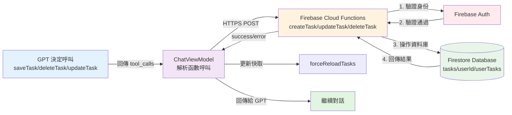

**說明**：
1. **GPT** 分析使用者需求後，決定呼叫操作類函數（saveTask/deleteTask/updateTask）
2. **ChatViewModel** 接收到函數呼叫請求，解析參數並準備資料
3. **Firebase Cloud Functions** 接收請求，先透過 **Firebase Auth** 驗證使用者身份
4. 驗證通過後，**Cloud Functions** 對 **Firestore Database** 進行寫入/更新/刪除操作
5. **Firestore** 完成操作後回傳結果給 **Cloud Functions**
6. **Cloud Functions** 將結果回傳給 **ChatViewModel**
7. **ChatViewModel** 觸發本地快取同步（forceReloadTasks），確保 UI 顯示最新資料
8. 函數執行結果被加入對話歷史，發送回 **GPT** 繼續對話

---

## 一、完整流程圖（Flowchart）

### 1.1 整體架構流程

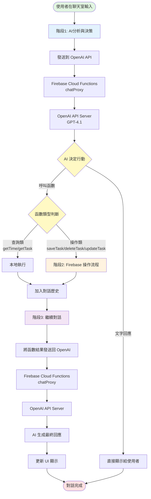

### 1.2 Firebase 操作詳細流程

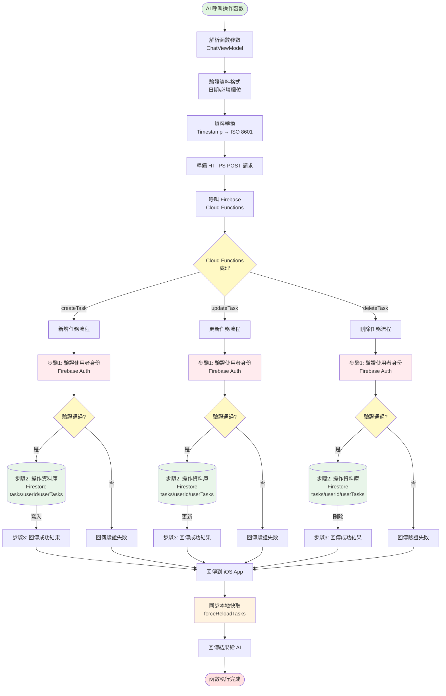

---

## 二、序列圖（Sequence Diagram）

### 2.1 完整對話與 Firebase 互動序列

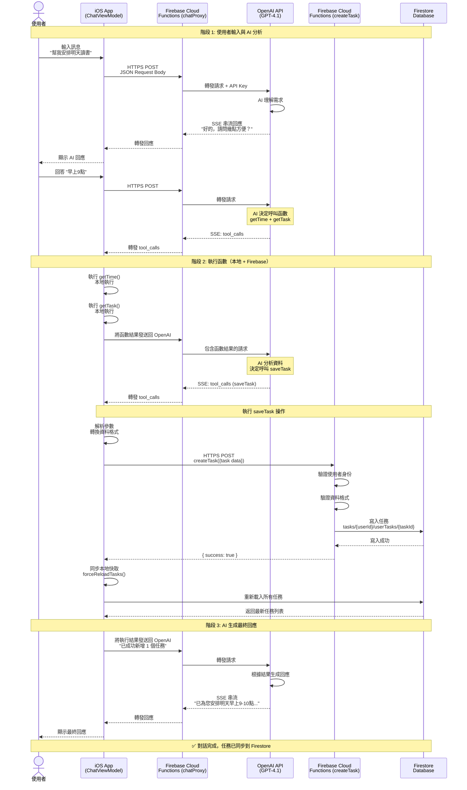

### 2.2 批量操作序列（例：批量新增任務）

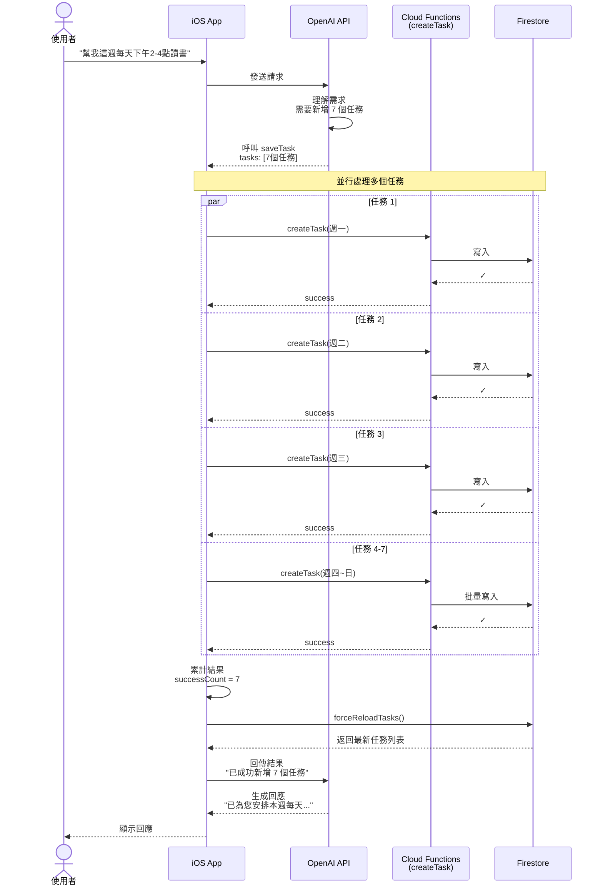

---

## 三、狀態圖（State Diagram）

### 3.1 聊天室任務操作狀態流轉

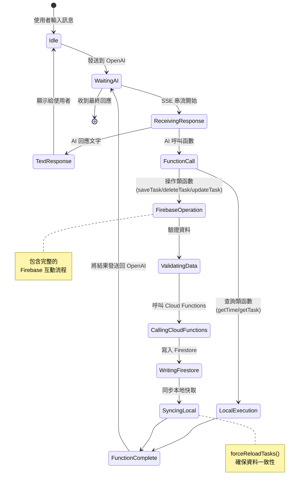

### 3.2 Firebase 操作詳細狀態

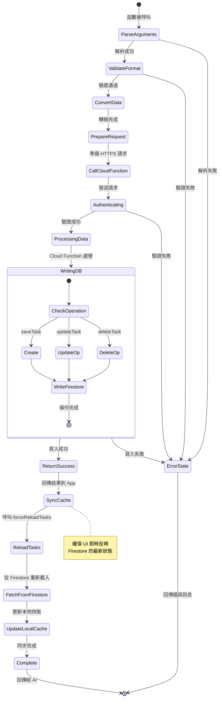

---

## 四、組件互動圖（Component Diagram）

### 4.1 系統架構與資料流

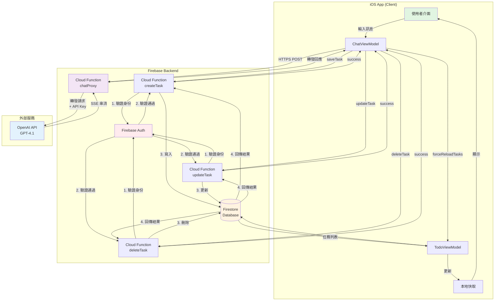

**重要安全流程說明**:
- Cloud Functions（CreateTask、UpdateTask、DeleteTask）在執行任何資料庫操作之前，**必須先通過 Firebase Auth 驗證**
- 驗證流程為序列化執行：
  1. **步驟 1**: Cloud Function 收到請求後，先向 Firebase Auth 驗證使用者身份
  2. **步驟 2**: 只有在驗證通過後，才會繼續執行
  3. **步驟 3**: 通過驗證後，才對 Firestore 進行寫入/更新/刪除操作
  4. **步驟 4**: Firestore 完成操作後回傳結果
- 此設計確保所有資料庫操作都經過身份驗證，防止未授權存取

---

## 五、錯誤處理流程圖

### 5.1 多層次錯誤處理

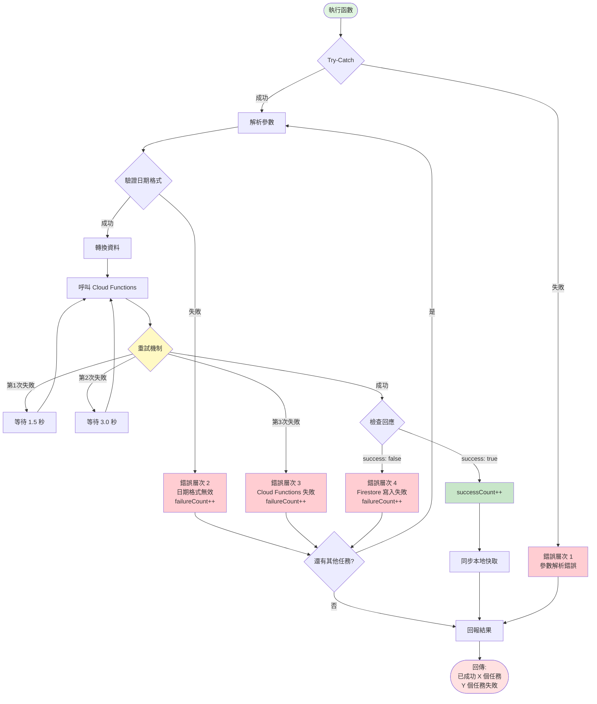

---

## 六、Tool Choice 策略流程圖

### 6.1 智慧 Tool Choice 決策

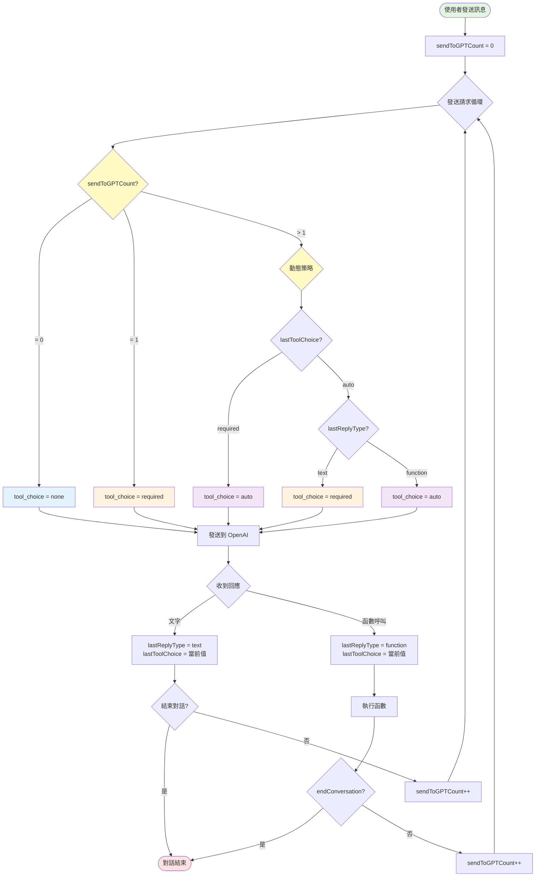

---

## 七、資料轉換流程

### 7.1 Timestamp 與 ISO 8601 轉換

```mermaid
flowchart LR
    subgraph iOS["iOS App"]
        TodoTask[TodoTask Object]
        Firestore1[toFirestore Method]
        Convert[convertTimestampsToStrings]
        JSON1[JSON for Cloud Functions]
    end

    subgraph CloudFunctions["Cloud Functions"]
        Receive[接收 JSON]
        Parse[解析參數]
        ConvertBack[ISO 8601 → Timestamp]
        FirestoreWrite[寫入 Firestore]
    end

    subgraph Database["Firestore"]
        Store[(儲存為 Timestamp 型別)]
    end

    TodoTask -->|包含 Date 物件| Firestore1
    Firestore1 -->|轉換為 Timestamp| Convert
    Convert -->|Timestamp → ISO 8601 String| JSON1

    JSON1 -->|HTTPS POST| Receive
    Receive --> Parse
    Parse --> ConvertBack
    ConvertBack -->|String → Timestamp| FirestoreWrite
    FirestoreWrite --> Store

    style TodoTask fill:#e3f2fd
    style JSON1 fill:#fff3e0
    style Store fill:#c8e6c9
    style Convert fill:#fff9c4
    style ConvertBack fill:#fff9c4
```

**轉換範例**:
```
iOS App (Date):
startDate = 2025-01-16 09:00:00

↓ toFirestore

Timestamp:
Timestamp(seconds: 1737014400, nanoseconds: 0)

↓ convertTimestampsToStrings

ISO 8601 String:
"2025-01-16T09:00:00+08:00"

↓ Cloud Functions

Timestamp:
Timestamp(seconds: 1737014400, nanoseconds: 0)

↓ Firestore

儲存為 Timestamp 型別
```

---

## 八、使用說明

### 如何在 Markdown 中使用這些圖表

1. **複製對應的 Mermaid 程式碼區塊**
2. **貼到支援 Mermaid 的 Markdown 編輯器中**
   - GitHub README.md
   - GitLab
   - Notion
   - Obsidian
   - Typora
   - VS Code (安裝 Mermaid 擴充套件)

3. **線上編輯器**
   - https://mermaid.live/
   - 可以即時預覽和調整

### 匯出為圖片

在 Mermaid Live Editor 中：
1. 編輯圖表
2. 點擊「Actions」
3. 選擇「PNG」或「SVG」匯出

---

## 九、圖表對照表

| 圖表類型 | 章節 | 用途 | 適合用於 |
|---------|------|------|---------|
| **Flowchart** | 一、1.1 | 整體架構流程 | 報告概覽章節 |
| **Flowchart** | 一、1.2 | Firebase 操作詳細流程 | 技術實作章節 |
| **Sequence Diagram** | 二、2.1 | 完整對話序列 | 系統互動說明 |
| **Sequence Diagram** | 二、2.2 | 批量操作序列 | 效能優化說明 |
| **State Diagram** | 三、3.1 | 任務操作狀態 | 狀態管理說明 |
| **State Diagram** | 三、3.2 | Firebase 操作狀態 | 詳細狀態流轉 |
| **Component Diagram** | 四、4.1 | 系統架構 | 架構設計章節 |
| **Flowchart** | 五、5.1 | 錯誤處理流程 | 可靠性設計 |
| **Flowchart** | 六、6.1 | Tool Choice 策略 | AI 智慧策略 |
| **Flowchart** | 七、7.1 | 資料轉換流程 | 資料處理說明 |

---

## 十、建議使用方式

### 報告章節建議配置

**4.X 聊天室功能架構**
- 使用：一、1.1 整體架構流程 (Flowchart)
- 說明整體運作流程

**4.X.1 AI 對話流程**
- 使用：二、2.1 完整對話序列 (Sequence Diagram)
- 展示各組件互動時序

**4.X.2 Firebase 操作機制**
- 使用：一、1.2 Firebase 操作詳細流程 (Flowchart)
- 說明資料庫操作流程

**4.X.3 系統架構設計**
- 使用：四、4.1 系統架構 (Component Diagram)
- 展示各組件關係

**4.X.4 智慧策略設計**
- 使用：六、6.1 Tool Choice 策略 (Flowchart)
- 說明 AI 決策機制

**4.X.5 錯誤處理機制**
- 使用：五、5.1 錯誤處理流程 (Flowchart)
- 說明多層次錯誤處理

**4.X.6 批量操作優化**
- 使用：二、2.2 批量操作序列 (Sequence Diagram)
- 展示並行處理優勢

---

這些 Mermaid 圖表提供了清晰的視覺化呈現，讓讀者能快速理解複雜的系統互動流程。所有圖表都可以直接用於專題報告、文件或簡報中。
