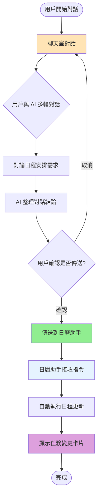

# 聊天室到日曆助手整合流程

## 簡易流程圖



---

## 流程說明

### 聊天室階段

用戶在聊天室中與 AI 進行多輪對話，討論並確立日程安排的需求與規則。對話過程中，AI 會理解用戶的習慣、偏好、優先順序等資訊。當討論達到一定程度後，AI 會整理出對話結論，產生一套可執行的更新指令。

### 確認與傳送

系統會向用戶展示整理後的更新指令，讓用戶確認是否要傳送給日曆助手執行。用戶可以選擇取消（返回繼續對話修改），或確認傳送。確認後，這些指令會被傳遞到日曆助手模組。

### 日曆助手執行

日曆助手接收到來自聊天室的指令後，會自動啟動完整的更新流程。系統會構建系統提示、調用 GPT API、執行函數操作（新增、刪除、修改任務），並將結果寫入 Firebase。最後顯示任務變更卡片，讓用戶清楚看到所有的變更內容。

---

## 資料流動


---

## 關鍵優勢

### 智能整合
聊天室提供自然語言的討論空間，日曆助手提供精確的任務執行能力。兩者結合讓用戶可以先充分討論需求，再一鍵執行。

### 減少重複輸入
用戶不需要在日曆助手中重新輸入討論過的內容。聊天室會自動將對話結論轉換為日曆助手可理解的指令格式。

### 可追溯性
完整的對話歷史保留在聊天室中，用戶可以回顧為什麼做出某些日程決策。日曆助手則提供任務變更記錄與撤回功能。

---

## 使用場景範例

### 場景一：制定學習計畫

**聊天室對話**：
```
用戶：我下週有三門考試，需要幫我安排讀書時間
AI：請告訴我是哪三門科目？各需要準備多久？
用戶：數學、英文、程式設計，數學和程式各需要 10 小時，英文 5 小時
AI：根據你的習慣，每天晚上 7-10 點是你的讀書時間。
    我建議這樣安排：[詳細計畫]
用戶：看起來不錯
AI：是否要我將這個計畫傳送到日曆助手執行？
```

**傳送到日曆助手**：
```
檢查現有任務，在每天 19:00-22:00 時段安排：
- 週一、三、五：程式設計複習（每次 2 小時）
- 週二、四：數學複習（每次 2 小時）
- 週六：英文複習（5 小時）
如有時間衝突，優先保留高優先級任務
```

**日曆助手執行**：
- 自動檢查時間衝突
- 新增 8 個讀書任務
- 顯示變更卡片供確認

### 場景二：調整例行作息

**聊天室對話**：
```
用戶：我想改變作息，把運動時間從早上改到晚上
AI：瞭解，你目前每天早上 6:00-7:00 有運動。要改到晚上幾點？
用戶：晚上 8 點到 9 點
AI：好的，我會更新所有運動任務的時間
```

**傳送到日曆助手**：
```
找出所有類別為「運動」的未完成任務，
將時間從 06:00-07:00 改為 20:00-21:00
```

**日曆助手執行**：
- 找到 15 個運動任務
- 批次更新時間
- 顯示修改對比卡片

---

## 技術整合點

### 資料格式轉換
聊天室的自然語言結論需要轉換為日曆助手可接受的結構化指令。這通常由聊天室的 AI 負責，產生明確的更新規則文字。

### 狀態同步
當日曆助手完成更新後，聊天室可以獲得反饋，告知用戶已成功執行哪些操作。這確保兩個模組的狀態保持一致。

### 錯誤處理
如果日曆助手執行失敗（例如時間衝突無法解決），錯誤訊息會回傳到聊天室，讓用戶可以繼續對話調整規則。
